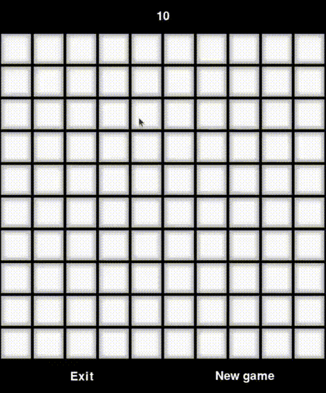

[](https://github.com/kozlova22107/orpopro/actions/workflows/main.yml)
[](https://coveralls.io/github/kozlova22107/orpopro?branch=main)
[](https://sonarcloud.io/summary/new_code?id=kozlova22107_orpopro)
[](https://sonarcloud.io/dashboard?id=kozlova22107_orpopro)


<a id="anchor"></a>
---
# Моя игрулька
___
```
Афтор: я
```



> <<Безнадежно — это когда на крышку гроба падает земля. Остальное можно исправить>>("Перевозчик")


---

Функциональные возможности:

1. Пользователь может запустить игру:
   - Пользователь нажимает на ярлык или значок приложения, чтобы запустить игру.
   - Приложение отображает главное меню с опциями "Новая игра",  "Выход" и предлагает ввести параметры.


2. Пользователь может открывать ячейки:
   - Пользователь нажимает на закрытую ячейку игрового поля.
   - Если ячейка не содержит бомбу, приложение открывает ячейку и соседние пустые ячейки.
   - Если ячейка содержит бомбу, приложение отображает проигрыш и предлагает начать новую игру или выйти.

3. Пользователь может помечать ячейки флагами:
   - Пользователь правой кнопкой мыши нажимает на закрытую ячейку.
   - Приложение помечает ячейку флагом.
   - Пользователь может снова нажать на ячейку с флагом, чтобы убрать флаг.

4. Пользователь может начать новую игру:
   - Пользователь выбирает начать новую игру.
   - Приложение отображает главное меню , где пользователь может изменять параметры, такие как размер игрового поля, количество бомб.
   - Пользователь вводит данные, начинает игру.
   - Приложение отображает игровое поле с закрытыми ячейками.

5. Пользователь может завершить игру:
   - Пользователь выбирает опцию "Выход" в главном меню.
   - Приложение закрывается.

## Диаграммы
* [**Функциональные модели**](docs/functions.md)
* [**Структурные модели**](docs/struct.md)
* [**Поведенческие модели**](docs/behavior.md)
* [**Перечень тестов**](docs/descriptions.md)


[Верх](#anchor)

