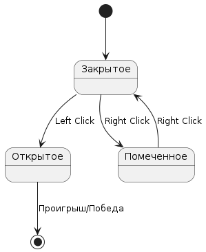
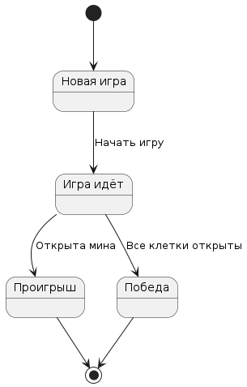
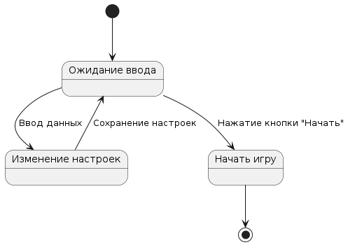
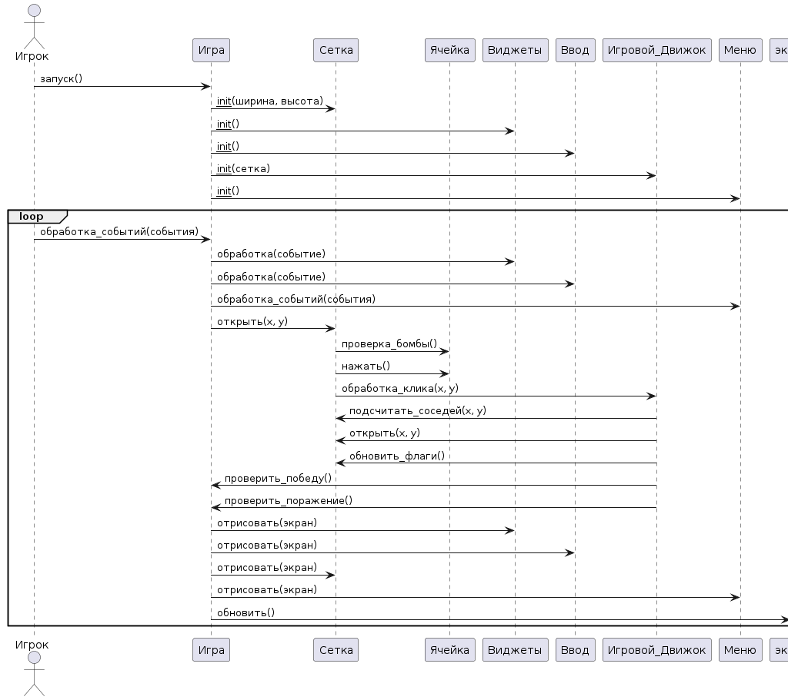

# Поведенчиские модели

## Диаграммы состояний

 1. Диаграмма состояний для игрового поля (Field):

[оффлайн файл](diagrams/asostpole.puml) 

 **Описание:**
 Эта диаграмма состояний показывает возможные состояния клетки игрового поля и переходы между ними. Клетка может быть закрытой, открытой или помеченной флагом. Переходы происходят при нажатии левой или правой кнопки мыши.

2. Диаграмма состояний для игрового процесса (Game):

 [оффлайн файл](diagrams/sostgame.puml)

 **Описание:**
 Эта диаграмма состояний описывает основные состояния игрового процесса: начало новой игры, игра в процессе, проигрыш и победа. Переходы происходят при запуске игры, открытии мины или открытии всех безопасных клеток.

3. Диаграмма состояний для настроек игры (Settings):

 [оффлайн файл](diagrams/sostset.puml)

 **Описание:**
 Эта диаграмма состояний описывает процесс настройки игры. Приложение ожидает ввода данных пользователем, после чего он может изменять настройки, такие как количество мин, ширина и высота игрового поля. Когда пользователь нажимает кнопку "Начать", приложение переходит к началу новой игры.

## Диаграмма последовательности

[оффлайн файл](diagrams/posl.puml)

 **Описание:**

1. Запуск игры:
   - Игрок запускает программу.
   - Объект Игры создается и инициализируется.
   - Объект Игры создает объекты Сетки, Виджетов, Ввода, Игрового движка и Меню.
   - Объект Меню отображает главное меню.
   - Игрок выбирает "Начать игру" в главном меню.
   - Объект Игры получает событие и начинает игровой процесс.

2. Открытие ячейки:
   - Игрок нажимает на ячейку на игровом поле.
   - Объект Игры получает событие о нажатии на ячейку.
   - Объект Игры передает координаты ячейки объекту Игрового движка.
   - Объект Игрового движка открывает ячейку в объекте Сетки.
   - Объект Сетки обновляет состояние открытой ячейки.
   - Если ячейка содержит бомбу, объект Игры проверяет условие поражения.
   - Если условие поражения не выполнено, объект Игры обновляет состояние игры и отрисовывает обновленное игровое поле.

3. Постановка флага:
   - Игрок правой кнопкой мыши нажимает на закрытую ячейку.
   - Объект Игры получает событие о нажатии правой кнопкой.
   - Объект Игры передает координаты ячейки объекту Игрового движка.
   - Объект Игрового движка помечает ячейку в объекте Сетки как отмеченную флагом.
   - Объект Сетки обновляет состояние ячейки и ее отображение.
   - Объект Игры обновляет состояние игры и отрисовывает обновленное игровое поле.

4. Проверка победы:
   - После каждого хода игрока, объект Игры проверяет условие победы.
   - Объект Игры передает состояние игрового поля объекту Игрового движка.
   - Объект Игрового движка проверяет, были ли открыты все ячейки без бомб.
   - Если условие победы выполнено, объект Игры отображает экран победы.
   - Игрок может выбрать "Новая игра" или выйти в главное меню.

5. Обработка событий интерфейса:
   - Игрок взаимодействует с виджетами (кнопки, индикаторы) на экране.
   - Объект Игры получает события от объектов Виджетов и Ввода.
   - Объект Игры обрабатывает эти события и обновляет соответствующие элементы интерфейса.
   - Например, при нажатии на кнопку "Новая игра" объект Игры инициализирует новую игру.

Эта диаграмма последовательностей показывает основные сценарии взаимодействия между объектами игровой программы, описывая, как объекты обмениваются сообщениями для выполнения различных игровых функций.

