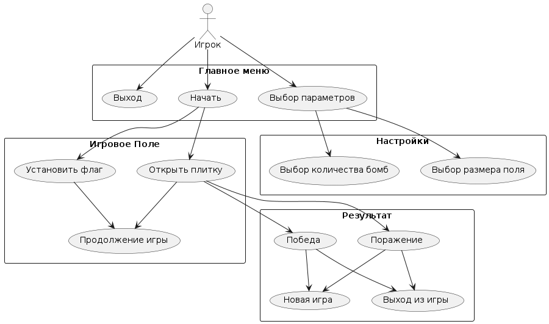
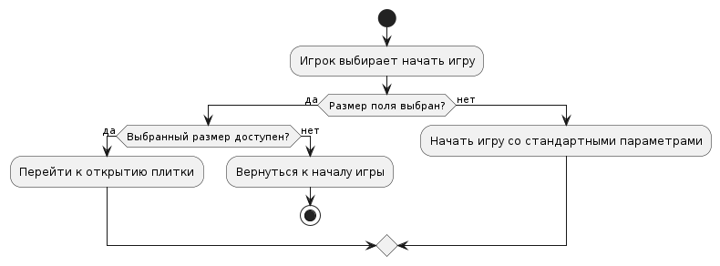
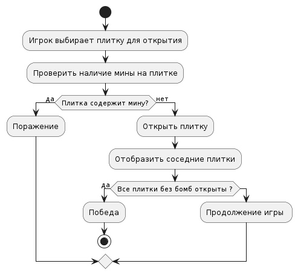
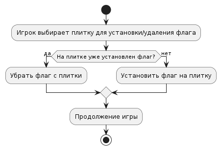

# Функциональные модели

## Диаграмма вариантов использования приложения:
* [оффлайн файл](diagrams\usecase.puml)

## Запуск приложения:
**Пользователь запускает приложение**
 1. Начать игру:
   - Игрок выбирает начать игру.
   - Переход к шагу 2.
   - Если шаг 2 не выполнен, то программа переходит к шагу 3 со стандартными параметрами.
2. Выбор размера поля:
   - Игрок выбирает размер поля (ширина и длина), количество бомб.
   - Программа проверяет доступность выбранных параметров.
   - Если размер поля доступен, то программа переходит к шагу 3.
   - Если размер поля недоступен, то программа шагу 1.

* [оффлайн файл](diagrams/actnach.puml)

## 3. Игровой процесс:
**Пользователь играет**
* 3.1. Открыть плитку (закрытая):
   - Программа проверяет, содержится ли на плитке мина.
   - Если плитка содержит мину, то программа переходит к шагу 3.1.1.
   - Если плитка не содержит мины, то программа переходит к шагу 3.1.2.

3.1.1. Открыть плитку с миной:
   - Программа отсчитывает Поражение.
   - Программа возвращается к шагу 1.

3.1.2. Открыть плитку без мины:
   - Программа отображает соседние открытые и закрытые плитки.
   - Программа переходит к шагу 3.

* [оффлайн файл](diagrams/actotcr.puml)

* 3.2 Установка флагов
- Игрок выбирает плитку для установки или удаления флага.
- Если на плитке уже находится флаг, то игрок убирает его с плитки.
- Если на плитке нет флага, то игрок устанавливает флаг на нее.

* [оффлайн файл](diagrams/actflag.puml)

