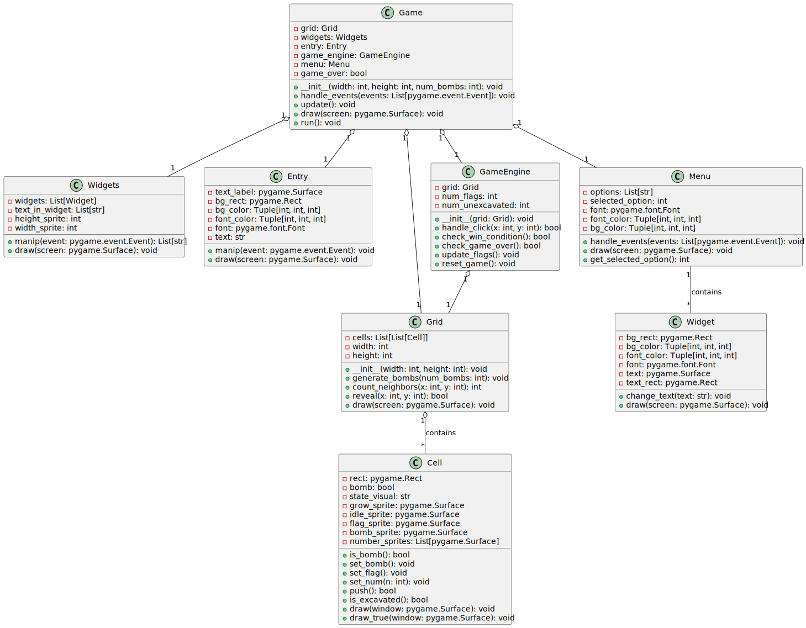
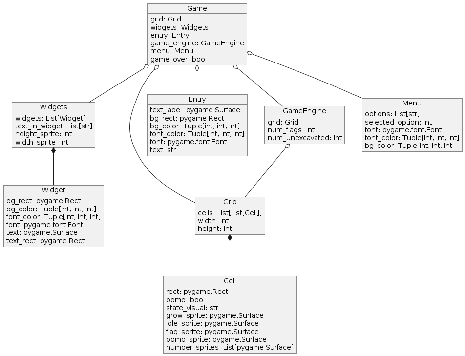

# Структурные модели

## Диаграмма классов приложения

1. Игра (Game): 
   - Атрибуты:
     - ширина: int
     - высота: int
     - сетка: Grid
     - виджеты: Widgets
     - ввод: Entry
     - игровой_движок: GameEngine
     - меню: Menu
   - Методы:
     - init(ширина, высота)
     - запуск()
     - обработка_событий(события)
     - проверить_победу()
     - проверить_поражение()
     - отрисовать(экран)
     - обновить()

2. Сетка (Grid):
   - Атрибуты:
     - ширина: int
     - высота: int
     - ячейки: list[Cell]
   - Методы:
     - init(ширина, высота)
     - открыть(x, y)
     - проверка_бомбы()
     - нажать()
     - обновить_флаги()
     - отрисовать(экран)

3. Ячейка (Cell):
   - Атрибуты:
     - x: int
     - y: int
     - открыта: bool
     - помечена: bool
     - бомба: bool
   - Методы:
     - init(x, y)
     - проверка_бомбы()
     - нажать()

4. Виджеты (Widgets):
   - Атрибуты:
     - кнопки: list[Button]
     - индикаторы: list[Indicator]
   - Методы:
     - init()
     - обработка(событие)
     - отрисовать(экран)

5. Ввод (Entry):
   - Атрибуты:
     - поля_ввода: list[InputField]
   - Методы:
     - init()
     - обработка(событие)
     - отрисовать(экран)

6. Игровой движок (GameEngine):
   - Атрибуты:
     - сетка: Grid
   - Методы:
     - init(сетка)
     - подсчитать_соседей(x, y)
     - открыть(x, y)
     - обновить_флаги()

7. Меню (Menu):
   - Атрибуты:
     - главное_меню: MainMenu
     - меню_настроек: SettingsMenu
   - Методы:
     - init()
     - обработка_событий(события)
     - отрисовать(экран)

* [оффлайн файл](diagrams/class.txt)

 
## Диаграмма объектов приложения

1. Объект Игры (Game): 
   - Этот объект является центральным элементом программы и отвечает за общую координацию работы всех других объектов.
   - Он содержит ссылки на объекты Сетки, Виджетов, Ввода, Игрового движка и Меню.
   - Обрабатывает события пользователя, обновляет состояние игры, проверяет условия победы/поражения и отрисовывает элементы на экране.

2. Объект Сетки (Grid):
   - Этот объект представляет игровое поле, состоящее из множества ячеек.
   - Он содержит список объектов Ячеек, которые хранят информацию о состоянии каждой ячейки.
   - Объект Сетки отвечает за открытие ячеек, проверку наличия бомб, обновление флагов и отрисовку игрового поля.

3. Объекты Ячеек (Cell):
   - Каждый объект Ячейки представляет одну ячейку на игровом поле.
   - Он содержит информацию о координатах ячейки, ее состоянии (открыта, помечена флагом, наличие бомбы) и обеспечивает методы для проверки наличия бомбы и нажатия на ячейку.

4. Объекты Виджетов (Widgets):
   - Этот объект содержит набор различных интерфейсных элементов, таких как кнопки, индикаторы и т.д.
   - Он отвечает за обработку событий, связанных с этими виджетами, и их отрисовку на экране.

5. Объект Ввода (Entry):
   - Этот объект обрабатывает ввод пользователя, например, текстовый ввод в поля формы.
   - Он содержит список объектов полей ввода и отвечает за их отображение и обработку.

6. Объект Игрового движка (GameEngine):
   - Этот объект реализует основную игровую логику, такую как подсчет соседних ячеек, проверка условий победы/поражения и т.д.
   - Он взаимодействует с объектом Сетки, открывая ячейки и обновляя флаги.

7. Объект Меню (Menu):
   - Этот объект отвечает за отображение и управление различными меню игры, такими как главное меню, меню настроек и т.д.
   - Он содержит объекты для каждого типа меню и обрабатывает события, связанные с ними.

* [оффлайн файл](diagrams/obj.puml)
